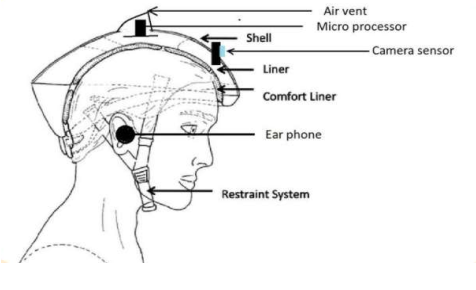
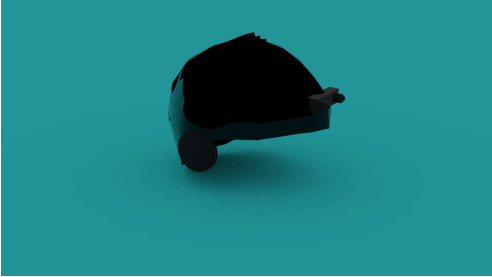
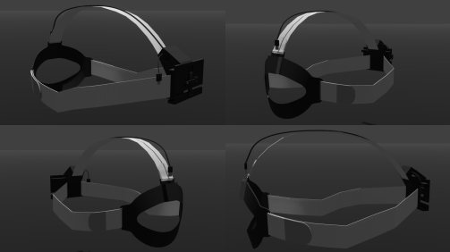

# SecondaryVision
## Problem Statement

Aims at restoring independence and normalcy in the lives of the blind and visually impaired through a sensory substitution device (SSD). Proposed solution consists of the substitution of vision through audition.

## Proposed Solution

 * A Device that uses a system of stereo camera and microphone to obtain information regarding the surroundings of the user. This information is then processed in order to generate a representation of the surroundings in terms of depth, the number of objects present, and their shape . 
* The objects in a particular depth range are selected and the acoustical representations of their shapes are generated by superposing tones of various musical frequencies. These acoustical representations are fed into an HRTF filter, spatialized, and merged with the ambisonic recording of the environment in order to produce the output sound delivered to the user.

## Literature Review

We reviewed more than 21 papers related to visual substitution through audition. Some papers that were found useful are given below.

- N. E. Shandu, P. A. Owolawi, T. Mapayi and K. Odeyemi, "AI Based Pilot System for Visually
Impaired People," 2020 International Conference on Artificial Intelligence, Big Data, Computing
and Data Communication Systems (icABCD), 2020, pp. 1-7, doi:
10.1109/icABCD49160.2020.9183857.
- Lorenzo Picinali, Amandine Afonso, Michel Denis, Brian F.G. Katz,
Exploration of architectural spaces by blind people using auditory virtual reality for the
construction of spatial knowledge,
International Journal of Human-Computer Studies, Volume 72, Issue 4, 2014, Pages 393-407,
ISSN 1071-5819, https://doi.org/10.1016/j.ijhcs.2013.12.008.
- P. B. L. Meijer, "An experimental system for auditory image representations," in IEEE
Transactions on Biomedical Engineering, vol. 39, no. 2, pp. 112-121, Feb. 1992, doi:
10.1109/10.121642.
- O. Gamal, S. Thakkar and H. Roth, "Towards Intelligent Assistive System for Visually Impaired
People: Outdoor Navigation System," 2020 24th International Conference on System Theory,
Control and Computing (ICSTCC), 2020, pp. 390-397, doi:
10.1109/ICSTCC50638.2020.9259682.
- Capelle C, Trullemans C, Arno P, Veraart C. A real-time experimental prototype for enhancement
of vision rehabilitation using auditory substitution. IEEE Trans Biomed Eng. 1998
Oct;45(10):1279-93. doi: 10.1109/10.720206. PMID: 9775542.

## Prototyping of solution

* Aimed at providing a proof of concept of the solution proposed through prototyping.
* The prototype was created by dividing the system into three modules and functionality of each module was demonstrated by simulations.
* The modules are:
  * Computer Vision 
  * Sound Engineering 
  * Design of device
### Computer Vision Module

The Following tasks were carried out under this module :
 * Implemented ARCore - Google’s API for Augmented reality application using Unity. 
 * Various features of the API such as anchors, point clouds, and real-time depth mapping using Depth API were explored. 
 * An application was developed to generate real-time depth maps using the aforementioned API and was then used in the simulation of the system.
 * From the extracted depth map edge detection using OpenCV’s canny edge detector was used along with binarization to extract the regions of interest from the depth map. 
 * A non-max suppression algorithm (written from scratch) was then used on these ROIs in order to reduce the number of ROIs reducing the computational time complexity. 
 * The ROIs selected by the NMS algorithm were then used to calculate the average depth of the object represented by that ROI. 
 * Using the relative position of ROI in the depth image and average depth calculated a location was mapped in the virtual scene where the virtual sound source was spawned

### Sound Engineering Module

The following tasks were carried out under this module :
* Google’s Resonance Audio Asset for sound spatialization was used to set up a virtual environment to spatialize sound .
* Developed and fine-tuning the model for sound spatialization in which parameters such as intensity roll-off , doppler effect , cut-off region were taken care of. 
* An interesting problem of interference of sounds in an environment with multiple-sound sources was solved by changing the frequency as well as the characteristic waveform of these sound sources.

### Design of Device

The device was decided to be a head mounted device.

* Preliminary Design / Paper prototyping : The helmet would be a triple layer structure and each layer is meant for different purposes for example top layer is meant for ventilation and tensile strength, the middle layer is used for ventilation only and the innermost is meant for comfortableness and also insulation. The material selected was the mixture of GRP and FRP or their composite. The helmet will have a mounting place for the camera and so have some slots for adjustment of the circuit components.

* 3D prototype based on preliminary design :

* However keeping in mind the comfort of the user the following variant was decided :

